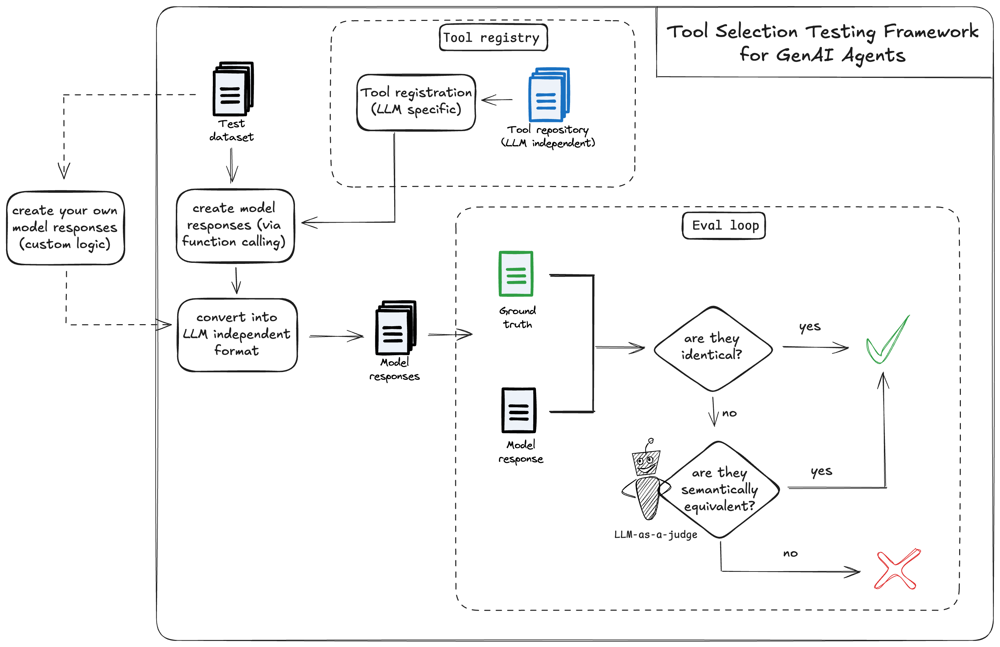

# Tool Selection Tester for GenAI Agents

A framework for testing and evaluating LLM's capabilities to select tools and respond to user queries across different scenarios. Compatible with Gemini and OpenAI models.

## Repository Structure

```
genai-agent-tool-selection-testing/
├── main.py                # Main entry point and test orchestration
├── models.py              # Model implementations (OpenAI, Gemini)
├── evaluator.py           # Evaluation logic and metrics
├── model_tester.py        # Test execution engine
├── utils.py               # Utility functions for processing responses
├── tools/
│   ├── functions.py      # Function definitions for tool calling
│   └── function_registry.py       # Function registry and model-specific formatting
├── datasets/
│   ├── test_dataset.json  # Combined test dataset
├── prompts/
│   ├── semantic_judge_tool_selection.txt
│   ├── semantic_judge_error.txt
│   └── semantic_judge_clarifying.txt
│   ├── semantic_judge_no_tool.txt
│   └── semantic_judge_not_supported.txt
├── results/              # Test run outputs
├── requirements.txt
└── README.md
```

## Architecture



## Test Datasets

The framework includes several specialized test datasets that are combined into a unified test dataset:

1. **Tool Selection Tests**
   - Tests model's ability to select appropriate functions
   - Includes ground truth function calls with arguments
   - Covers various domains (weather, navigation, translation, etc.)

2. **Clarification Tests**
   - Tests model's ability to request missing information
   - Validates appropriate clarifying questions
   - Ensures models don't make assumptions with incomplete data

3. **Error Handling Tests**
   - Tests model's response to invalid inputs
   - Includes cases like invalid dates, non-existent locations
   - Validates appropriate error messages

4. **Direct Response Tests**
   - Tests model's knowledge-based responses
   - No function calling required
   - Factual questions with clear ground truth

5. **Not Supported Tests**
   - Tests model's ability to gracefully handle unsupported actions
   - Includes requests for device control, media playback, real-time data
   - Validates clear communication of limitations
   - Ensures helpful alternative suggestions when possible

## Tool Repository

The framework includes a model-agnostic tool repository that defines available functions and automatically converts them to the appropriate format for each LLM at runtime.

### Tool Definition Structure

Tools are defined using a simple, model-independent format:

```python
Function(
    name="get_weather",
    description="Get the weather in a given location",
    parameters=[
        FunctionParameter(
            name="location",
            type="string",
            description="The city name of the location."
        )
    ]
)
```

### Available Tools

The framework includes common tools for testing:
- Weather information retrieval
- Time zone conversions
- Text translation
- Route calculation
- Hotel booking
- Stock price lookup
- Email sending
- News headlines retrieval
- Unit conversion
- Reminder setting
- Restaurant search
- Calendar event retrieval
- Math problem solving
- Word definition lookup
- Traffic condition checking

### Model-Specific Conversion

The tool registry automatically converts function definitions to model-specific formats:

1. **OpenAI Format**
   - Converts to OpenAI's function calling format
   - Includes required parameters specification
   - Maintains JSON Schema compatibility

2. **Gemini Format**
   - Converts to Gemini's FunctionDeclaration format
   - Preserves parameter descriptions and types
   - Packages functions into a Tool object

### Adding New Tools

To add new tools to the framework:

1. Define the function in `tools/functions.py`:
```python
registry.register(Function(
    name="your_function",
    description="Description of what your function does",
    parameters=[
        FunctionParameter(
            name="param_name",
            type="string",
            description="Parameter description",
            required=True  # or False for optional parameters
        )
    ]
))
```

2. The function will automatically be available to both Gemini and OpenAI models with the appropriate format conversion handled by the registry.

## End-to-End Process

The testing framework operates in three main stages:

1. **Model Testing**
   - Loads test cases from dataset
   - Initializes model (Gemini or OpenAI) with appropriate configuration
   - Executes each test case, capturing raw model responses
   - Handles both function calls and text responses based on expected_response_type
   - Manages API interactions and error handling

2. **Response Processing**
   - Converts model-specific response formats into a standardized structure
   - Extracts relevant information (function calls, arguments, text responses)
   - Handles different response structures between Gemini and OpenAI
   - Prepares responses for evaluation

3. **Evaluation**
   - Performs multi-level response validation:
     a. Response Type Check
        - Verifies if model provided expected response type (function call or text)
     b. Exact Match Check
        - For function calls: Matches function name and arguments exactly
        - For text responses: Direct string comparison
     c. Semantic Evaluation
        - Uses LLM as semantic judge with type-specific prompts
        - Evaluates response meaning and intent
        - Considers variations in phrasing and format
     d. Mismatch Analysis
        - Categorizes types of mismatches
        - Identifies specific differences in function calls
        - Analyzes parameter variations

## Using Custom Model Responses

You can use the test datasets with your own model and bring the responses back for evaluation:

1. **Load and Use Test Dataset**
   - Import test cases from the dataset
   - Use cases to test your own model implementation
   - Generate responses in the standardized format

2. **Format Responses**
   Your responses need to be in a JSON file with the following structure:
   ```json
   {
       "test_results": [
           {
               "id": "A001",
               "type": "tool_selection",
               "user_query": "What's the weather like in New York?",
               "ground_truth": {
                   "function_call": {
                       "name": "get_weather",
                       "arguments": {
                           "location": "New York"
                       }
                   },
                   "text": null,
                   "expected_response_type": "function_call"
               },
               "model_function_call": {
                   "name": "get_weather",
                   "arguments": {
                       "location": "New York"
                   }
               },
               "model_text": null
           },
           {
               "id": "B001",
               "type": "text_response",
               "user_query": "What is the capital of France?",
               "ground_truth": {
                   "function_call": null,
                   "text": "The capital of France is Paris.",
                   "expected_response_type": "text"
               },
               "model_function_call": null,
               "model_text": "Paris is the capital of France."
           }
       ]
   }
   ```

3. **Run Evaluation**
   Use the evaluation-only mode to assess your model's responses:
   ```bash
   python main.py \
     --eval-only \
     --processed-responses path/to/your/responses.json \
     --semantic-judge-model gemini-1.5-flash-002
   ```

## Running Tests

```bash
# Test function calling with Gemini
python main.py --model-type gemini --mode function_call --dataset datasets/test_tool_selection.json

# Test direct responses with OpenAI
python main.py --model-type openai --mode no_function --dataset datasets/test_no_tool.json --openai-api-key YOUR_KEY
```

## Command Line Arguments

The application supports various command-line arguments for customization:

### Required Arguments
- `--model-type`: Type of model to test (`gemini` or `openai`)
- `--dataset`: Path to test dataset file
  - Example: `--dataset datasets/test_tool_selection.json`
  - Not required in eval-only mode

### Required Arguments (for eval-only mode)
- `--eval-only`: Run in evaluation-only mode
  - Flag only, no value needed
  - Example: `--eval-only`

- `--processed-responses`: Path to your processed responses file
  - Example: `--processed-responses results/my_responses.json`

### Optional Arguments
- `--mode`: Testing mode (default: 'function_call')
  - Choices: `function_call`, `no_function`
  - Example: `--mode no_function`

- `--openai-model-name`: OpenAI model to use (default: 'gpt-4-1106-preview')
  - Example: `--openai-model-name gpt-4`

- `--gemini-model-id`: Gemini model ID (default: 'gemini-1.5-pro-002')
  - Example: `--gemini-model-id gemini-1.0-pro`

- `--openai-api-key`: OpenAI API key (required for OpenAI models)
  - Example: `--openai-api-key sk-...`

- `--semantic-judge-model`: Model for semantic evaluation
  - Example: `--semantic-judge-model gpt-4`

- `--semantic-judge-prompt`: Path to custom semantic judge prompt file
  - Example: `--semantic-judge-prompt prompts/custom_prompt.txt`

- `--skip-evaluation`: Skip the evaluation phase after running tests
  - Flag only, no value needed
  - Example: `--skip-evaluation`

### Example Commands

1. Basic Gemini test with function calling:
```bash
python main.py --model-type gemini --dataset datasets/test_tool_selection.json
```

2. OpenAI test with custom model and evaluation settings:
```bash
python main.py \
  --model-type openai \
  --mode no_function \
  --dataset datasets/test_no_tool.json \
  --openai-api-key YOUR_KEY \
  --openai-model-name gpt-4 \
  --semantic-judge-model gpt-4 \
  --semantic-judge-prompt prompts/custom_prompt.txt
```

3. Gemini test with evaluation skipped:
```bash
python main.py \
  --model-type gemini \
  --dataset datasets/test_clarifying.json \
  --skip-evaluation
```

4. Evaluate your own model responses:
```bash
python main.py \
  --eval-only \
  --processed-responses results/my_model_responses.json \
  --mode no_function \
  --semantic-judge-model gemini-1.5-pro-002 \
  --semantic-judge-prompt prompts/semantic_judge_not_supported.txt
```

## Requirements

- Python 3.7 or higher
- OpenAI API key (for OpenAI models)
- Google Cloud credentials (for Gemini model)
- Required packages in requirements.txt

## License

This project is licensed under the MIT License.